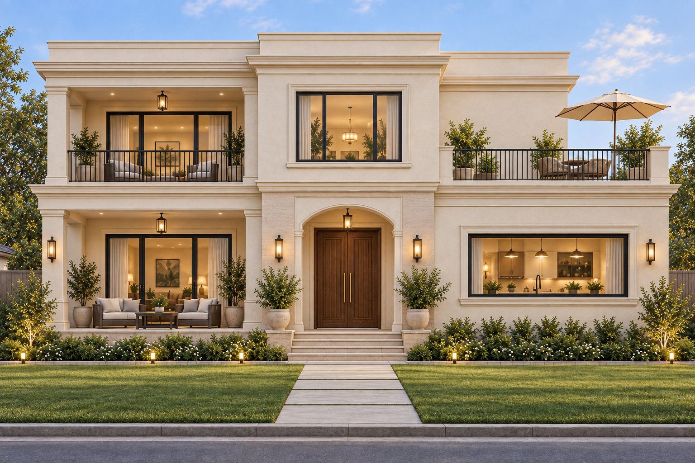
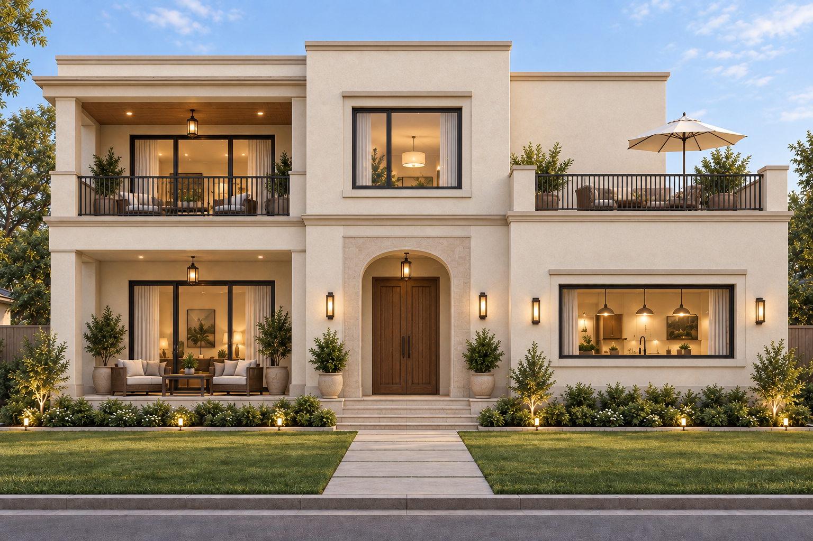
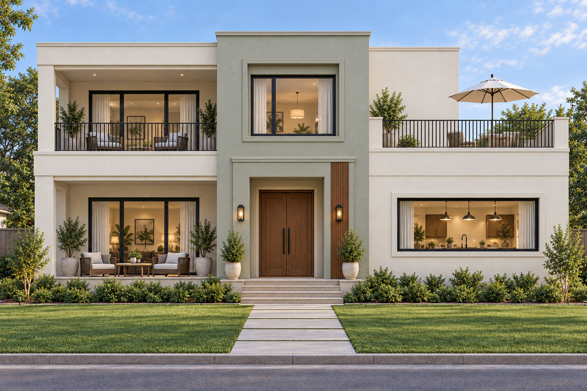

# Three restrained modern / heritage front options

All three show the front only, retaining the covered left balcony, central enclosed upper room and open right terrace in concept. **Option A was selected on 8 September 2026.** See [the selected exterior](SELECTED-EXTERIOR.md) for matching side/rear images and the updated 3D model. The floor plan remains unchanged.

## A — Quiet classical

Warm ivory, shallow entrance arch, simple columns, light cornice bands and slim metal railings. Most classical of the three; more decorative profiles to detail than B or C.

## B — Warm modern heritage

A small entrance arch, restrained trim, warm plaster and timber-tone balcony ceiling. A middle ground between the royal sample and a plain modern house.

## C — Simple contemporary

Rectangular openings, soft sage-gray central bay, off-white side wings, narrow timber-tone accent and simple railings. Least ornamental option; facade detailing is simpler, but actual cost still needs a quotation.

## Budget and longevity

These approaches reduce decorative complexity compared with the carved royal sample. They do not reduce the current roughly 3,868 sq ft floor area or establish that the project fits the original ₹45 lakh budget. The prior Latur project estimate remains approximately ₹1.1–₹1.5 crore, subject to detailed design and contractor quotes. Material selection, waterproofing, workmanship, sun exposure and maintenance matter alongside appearance. There is no guarantee of a specific future fashion or service life.

Use painted plaster for most surfaces, limit accent cladding, and keep railings/trim straightforward when obtaining facade quotations. Avoid assuming that every rendered finish is stone; a simpler material specification can be considered during design.

AI images simplify some openings relative to the dimensioned plan. Roof drainage, openings, posts, decoration and materials need coordination before construction. Images were created with built-in image generation; [exact prompts](outputs/elevations/MODERN-HERITAGE-PROMPTS.md) are retained.
