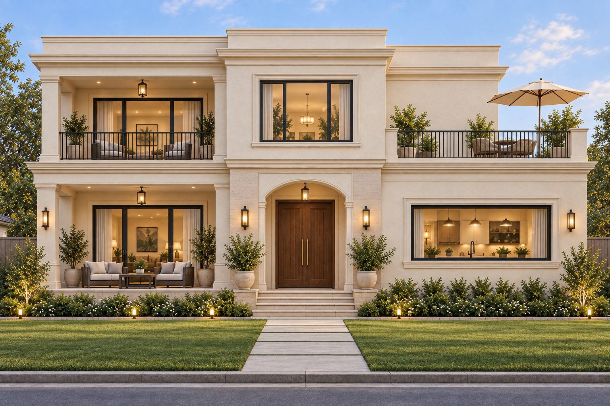
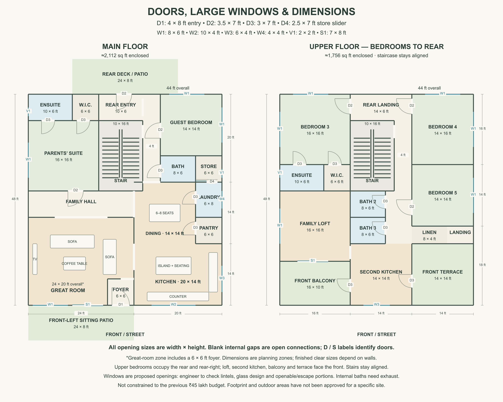

# HM

Home-design workspace published at [Personal-shri/HM](https://github.com/Personal-shri/HM). The latest selected direction is the **American-style family house**. All drawings are preliminary concepts, not construction or permit documents.

## Family website

The website brings the selected exterior, latest plans, interactive 3D, budget notes and downloads together. See [preview and Vercel deployment instructions](WEBSITE.md). Build with `npm run build`; preview with `npm start`.

## Exterior and 3D

**Selected: Option A — Quiet classical.** Ivory plaster, restrained cornices, a shallow entrance arch, dark window frames and railings, and flat roofs concealed by parapets.



[Front, both sides and rear](SELECTED-EXTERIOR.md) · [Interactive 3D — download HTML and open in browser](outputs/model/house-3d.html) · [Earlier facade alternatives](FRONT-OPTIONS.md)

The viewer includes all four appearance images and a simplified rotatable exterior model. Download the HTML to use it offline; GitHub does not run HTML previews. Interior exploration is a later stage.

## Fixed ₹45 lakh budget

[Construction packages, exterior allowance and feasibility review](BUDGET-45-LAKH.md). The compact-budget allocation is a proposed redesign target, not an estimate for the unchanged 3,868 sq ft house.

## Latest plan



[Full-size PNG](outputs/american-upper-rear.png) · [Editable SVG](outputs/american-upper-rear.svg) · [Door/window schedule](OPENING-SCHEDULE.md) · [Cost estimate for Latur](COST-ESTIMATE.md)

Current revision: upstairs bedrooms are grouped at the rear and rear-right, around the staircase retained in its main-floor position. The family loft, second kitchen, balcony and terrace face the front. Total enclosed area remains approximately 3,868 sq ft. Earlier versions below are retained for comparison.

The latest drawing adds nominal door widths/heights, larger window assemblies, glazed patio doors, and dimension chains. The estimate assumes construction near Latur and distinguishes base construction from opening upgrades, outdoors, interiors, fees and contingency.

Latest alternative: great room at the front-left, kitchen at the front-right, bedrooms and service rooms behind; rear patio and a new front-left sitting patio, each 24 × 8 ft. A 6 × 6 ft front foyer is carved out of the great-room planning zone. Both floors are reversed front-to-back to retain stair alignment; the upper balcony and terrace now face the rear. This revision is presented for review.

Storage access revision: the main-floor storeroom now opens from the laundry via an indicative sliding door. The guest-bedroom connection is removed. See the [main-floor detail](outputs/american-front-living-main-floor.png). Sliding-door clearance, laundry equipment, ventilation and shelving require detailed coordination.

Five bedrooms across two floors; downstairs parents' suite and guest room; open great room, island kitchen, dining, pantry, laundry and storage; upstairs family lounge, second kitchen, balcony and terrace. Approximately **3,868 sq ft enclosed**, excluding outdoor areas. A garage is not included. This version sets aside the original India budget.

## Earlier versions

| Version | Drawing | Editable source |
| --- | --- | --- |
| Original compact Latur concept | [PNG](outputs/latur-home-plan.png) | [SVG](outputs/latur-home-concept.svg) |
| Larger rooms and downstairs laundry | [PNG](outputs/latur-home-larger-rooms.png) | [SVG](outputs/latur-home-larger-rooms.svg) |
| Separate living room with furniture and walking route | [PNG](outputs/latur-home-separate-living.png) | [SVG](outputs/latur-home-separate-living.svg) |
| Original American layout with rear great room | [PNG](outputs/american-family-house.png) | [SVG](outputs/american-family-house.svg) |

The initial interactive room-grouping fragment is in [concepts/home-concept.html](concepts/home-concept.html). It was written for the conversation's visualization runtime; its original tabs and theme need that runtime. The PNG drawings above can be viewed directly on GitHub from any device.

## Brief and design history

See [DESIGN-NOTES.md](DESIGN-NOTES.md) for requirements, assumptions, area changes and budget context.

## Regenerating drawings

Python 3 scripts in `outputs/` generate the SVGs without third-party Python packages. From the repository root:

```sh
python3 outputs/draw_plan.py
python3 outputs/draw_larger_plan.py
python3 outputs/draw_seating_plan.py
python3 outputs/draw_american_plan.py
python3 outputs/draw_american_front_living.py
python3 outputs/draw_dimensioned_plan.py
python3 outputs/draw_upper_rear_bedrooms.py
```

The scripts locate their files relative to their own directory. PNG exports are included; a vector-image renderer can export newly generated SVGs to PNG.

`outputs/latur-home-concept.svg.png` preserves an early, cropped preview for completeness. Use `outputs/latur-home-plan.png` for the complete original drawing.

## Before building

Room dimensions describe planning zones, not finished clear dimensions. A qualified local architect and engineers must resolve furniture clearances, wall thickness, structural support, plumbing, ventilation, egress, stairs, site setbacks and applicable requirements. Area and cost figures are preliminary, and no version has been approved or priced by a contractor.
