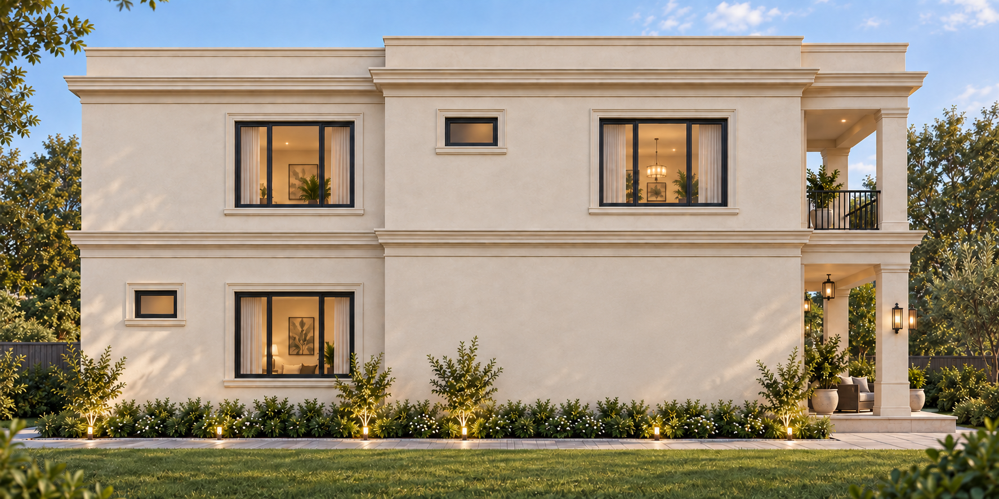
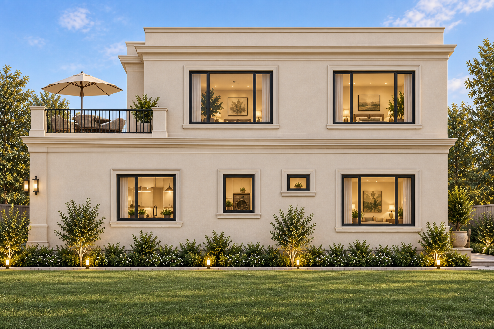
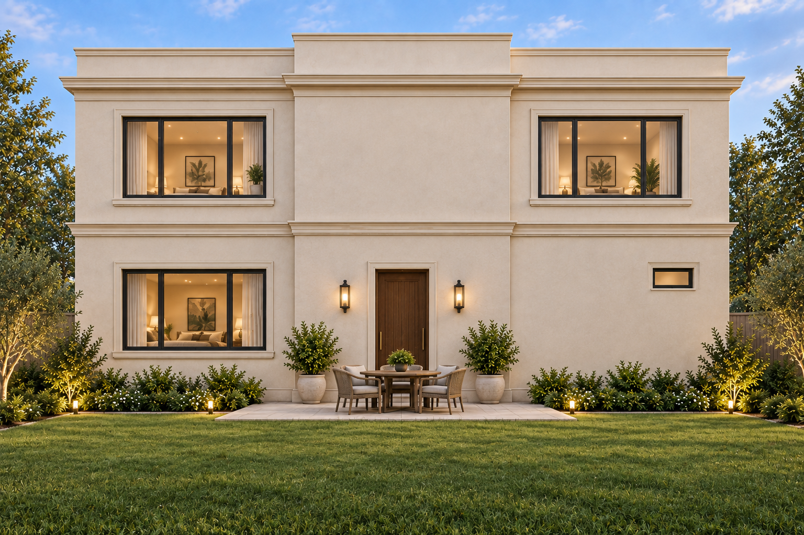
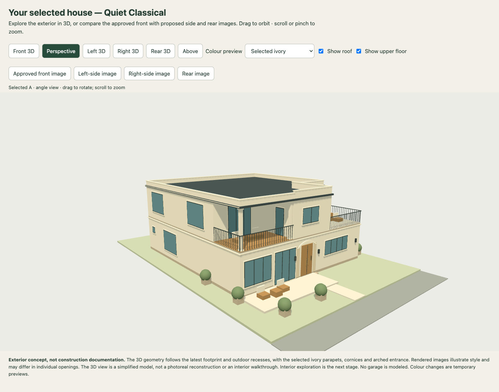

# Selected exterior — Quiet classical

Selected by the user on 8 September 2026. The supplied front reference is the appearance direction: ivory plaster, light cornice bands, a shallow entrance arch, wood double door, dark window frames and slim railings. The upper left balcony is covered; the upper right terrace is open. Left and right refer to the sides when standing in the street facing the front.

## Approved front

## Proposed left side

Front is on the right of this image.

## Proposed right side

Front is on the left of this image.

## Proposed rear

## Explore the exterior

[Download the standalone 3D viewer](outputs/model/house-3d.html) and open the downloaded file in a modern browser. It includes its viewing library and all four images for offline use. Drag to rotate, pinch or scroll to zoom, and use the front/left/right/rear/above buttons. The image buttons switch from the model to the appearance references. The viewer was checked in desktop and mobile-sized Chrome, with no page errors and all four images loading.

The simplified model follows the latest 44 × 48 ft footprint and upper recesses. Its roof is now flat with parapets. It is an exterior concept with solid wall masses, not a photoreal reconstruction, coordinated construction model, or interior walkthrough. Rendered side/rear views are proposed extensions of the approved front: individual openings and decorative details can differ from the model and dimensioned plan. Final openings, drainage and construction details require coordination. Interior exploration remains the next stage.

These appearance changes do not reduce the floor area or confirm the original ₹45 lakh budget; see the existing [cost estimate](COST-ESTIMATE.md).

Side and rear images were created with built-in image generation, using the approved front and plan as references. [Saved generation prompts](outputs/elevations/selected-a/PROMPTS.md).
