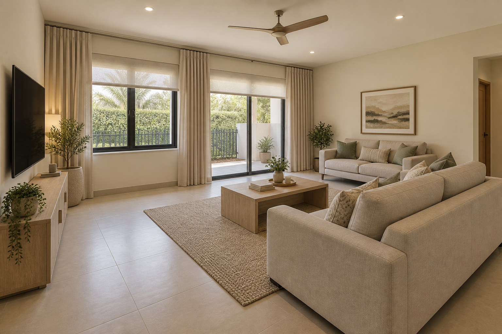
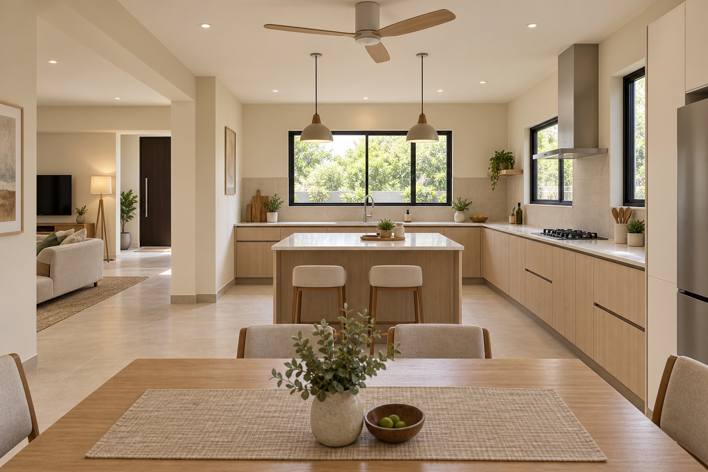
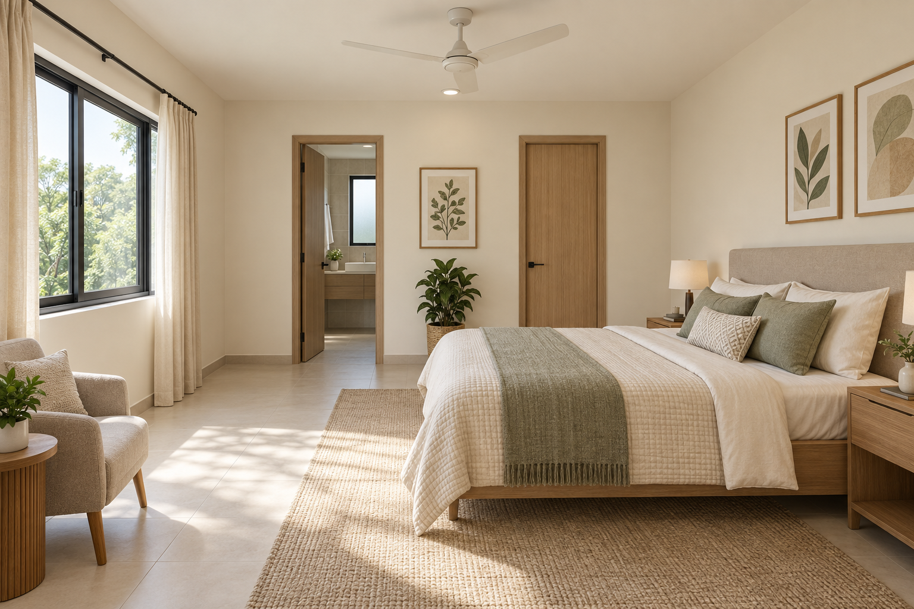
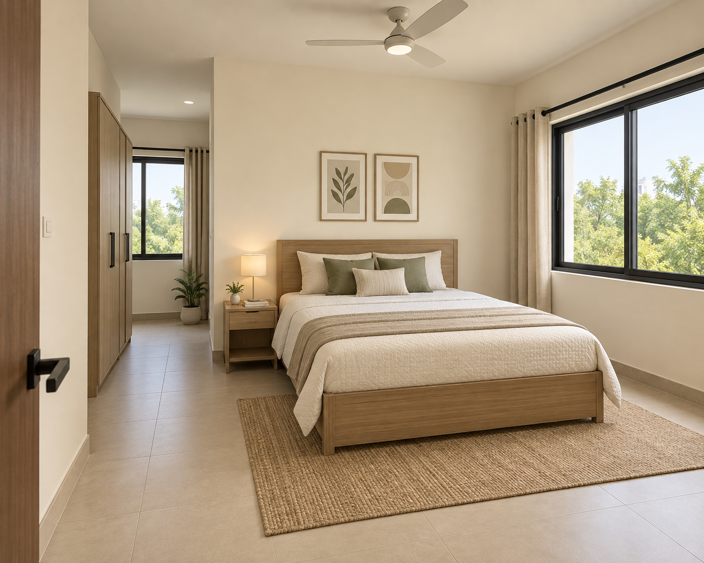
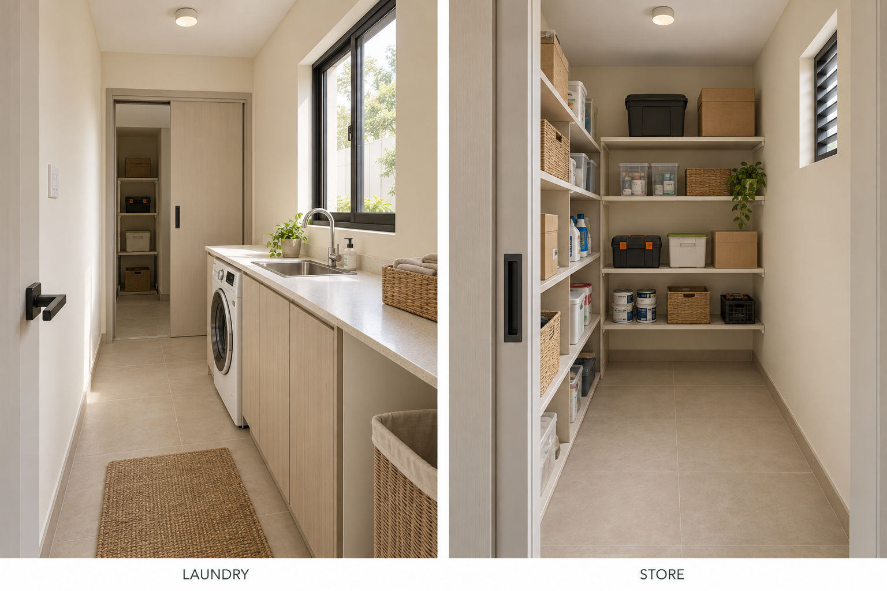
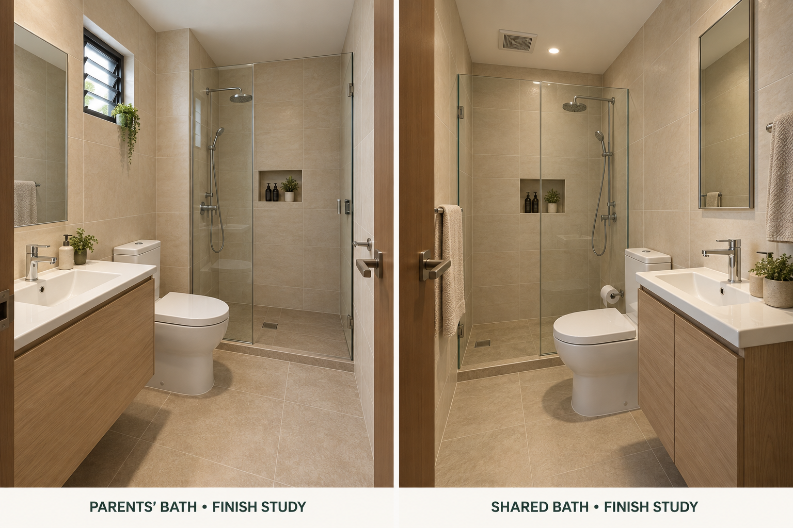
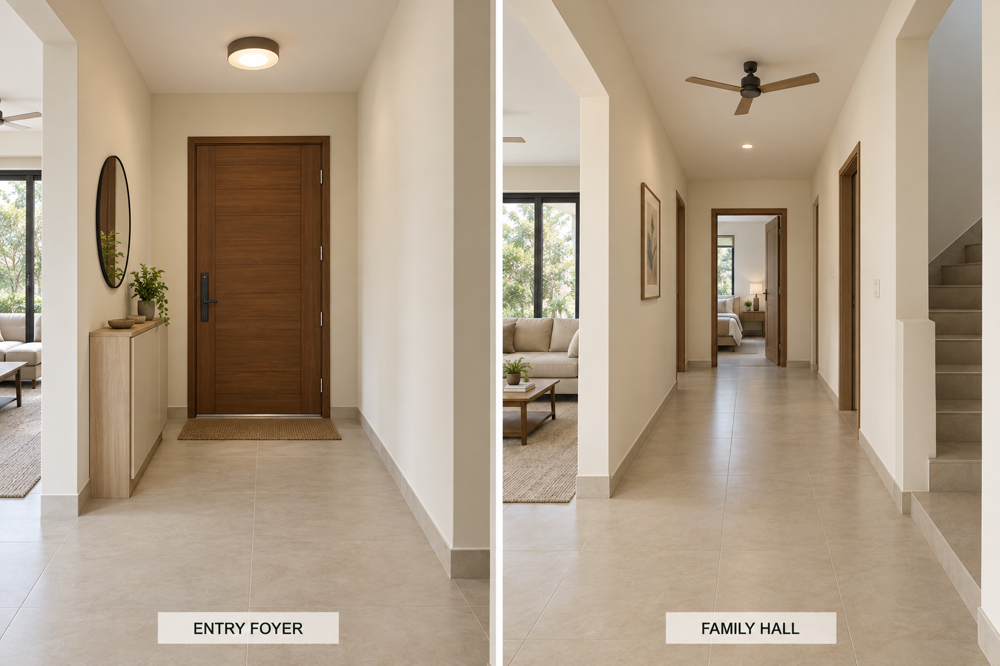
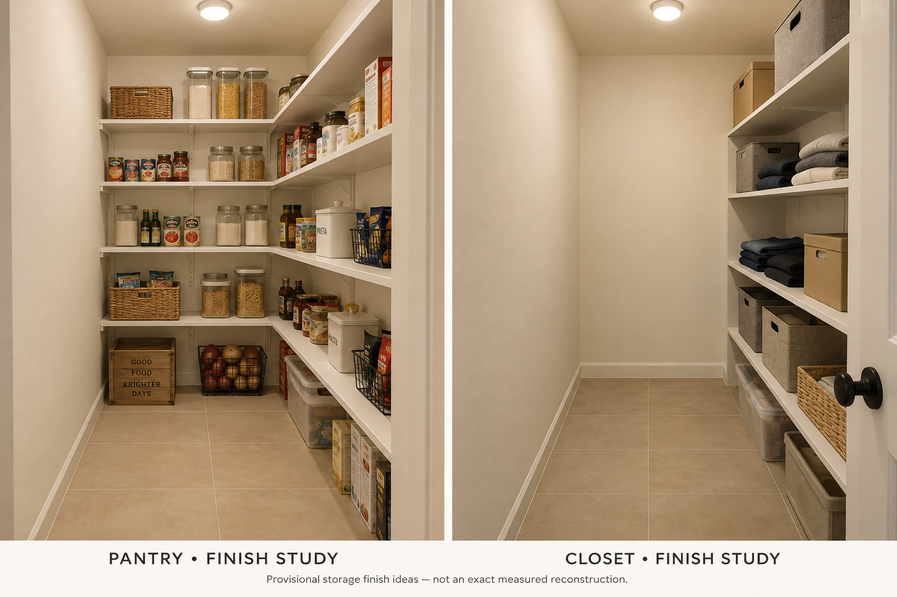

# Main-floor photo samples

Created with built-in image generation from the architectural and furniture plans. Eight sample images cover the main-floor interior spaces. These do not supersede the scaled furniture plan or confirm exact construction dimensions, furniture fit, budget or glare performance.

Known limits: secondary living-sofa placement is illustrative; laundry-to-store doorway lateral placement drifts from the scaled plan; foyer/hall image introduces openings and a stair arrangement not established by the plan. Those two circulation images are finish references only, not usable layouts. Bathroom fixtures and storage arrangements remain proposals. Kitchen, parents and guest images have targeted corrections saved as the final files here. Do not copy any additional openings from a render into the building.

## Living / TV and shading

## Kitchen and dining — corrected side window

## Parents’ bedroom — corrected bathroom doorway view

## Guest bedroom — corrected front wall

## Laundry and storeroom — finish concept

## Bathrooms — proposed finishes and fixture arrangements

## Foyer and family hall — finish concept

## Pantry and closet — storage finish concept

[Generation prompts](PROMPTS.md)

